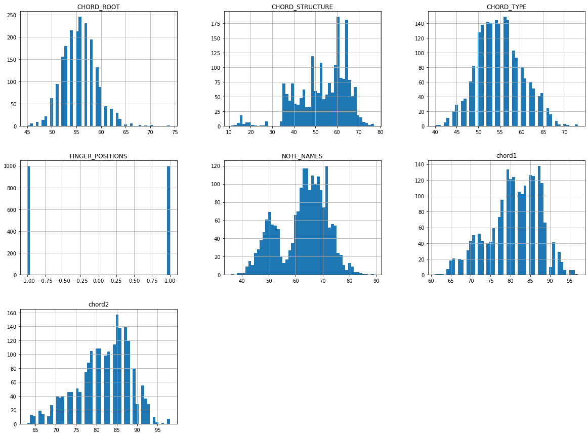
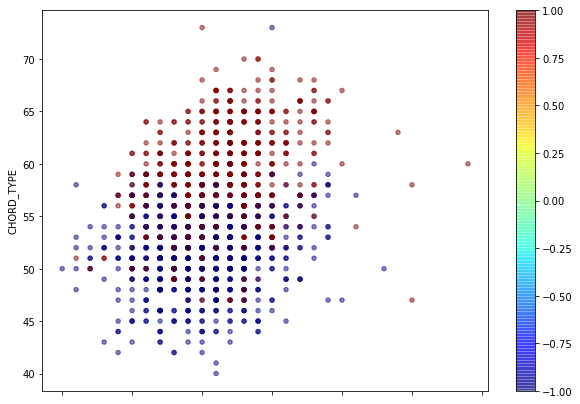
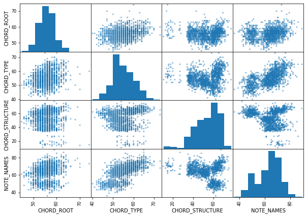
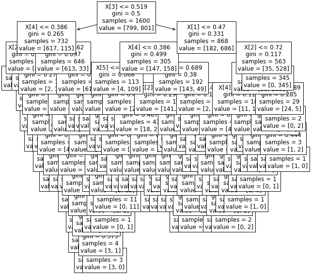
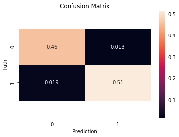
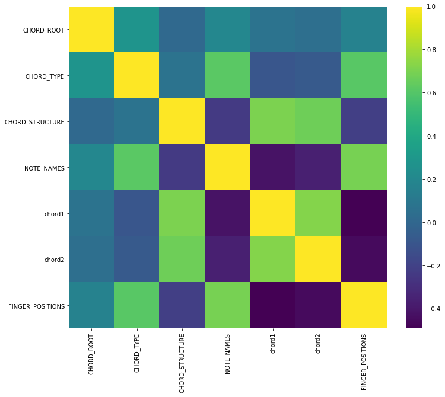
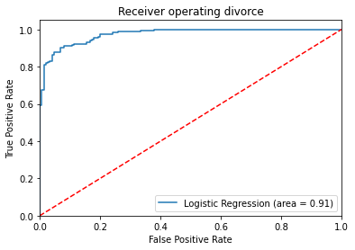

```python
# Author : Amir Shokri
# github link : https://github.com/amirshnll/Guitar-Chords-finger-positions
# dataset link : http://archive.ics.uci.edu/ml/datasets/Guitar+Chords+finger+positions
# email : amirsh.nll@gmail.com
```


```python
import numpy as np
import pandas as pd
import seaborn as sns

import matplotlib.pyplot as plt
from sklearn.model_selection import train_test_split
from pandas.plotting import scatter_matrix
chord= pd.read_csv('chord-fingers.csv')
chord.head()
```


<div>
<style scoped>
    .dataframe tbody tr th:only-of-type {
        vertical-align: middle;
    }

    .dataframe tbody tr th {
        vertical-align: top;
    }

    .dataframe thead th {
        text-align: right;
    }
</style>
<table border="1" class="dataframe">
  <thead>
    <tr style="text-align: right;">
      <th></th>
      <th>CHORD_ROOT</th>
      <th>CHORD_TYPE</th>
      <th>CHORD_STRUCTURE</th>
      <th>NOTE_NAMES</th>
      <th>chord1</th>
      <th>chord2</th>
      <th>FINGER_POSITIONS</th>
    </tr>
  </thead>
  <tbody>
    <tr>
      <th>64</th>
      <td>56</td>
      <td>61</td>
      <td>66</td>
      <td>71</td>
      <td>82</td>
      <td>81</td>
      <td>1</td>
    </tr>
    <tr>
      <th>68</th>
      <td>57</td>
      <td>61</td>
      <td>65</td>
      <td>71</td>
      <td>85</td>
      <td>85</td>
      <td>1</td>
    </tr>
    <tr>
      <th>63</th>
      <td>60</td>
      <td>60</td>
      <td>67</td>
      <td>76</td>
      <td>85</td>
      <td>84</td>
      <td>1</td>
    </tr>
    <tr>
      <th>61</th>
      <td>60</td>
      <td>68</td>
      <td>62</td>
      <td>77</td>
      <td>90</td>
      <td>80</td>
      <td>1</td>
    </tr>
    <tr>
      <th>63</th>
      <td>65</td>
      <td>60</td>
      <td>63</td>
      <td>77</td>
      <td>81</td>
      <td>87</td>
      <td>1</td>
    </tr>
  </tbody>
</table>
</div>


```python
#chord.tail()
#chord.shape
#chord[:7]
chord.info()
#chord.columns
#chord['A'].unique()
#chord['B'].unique()
#chd['C'].unique()
#chord['D'].unique()
#chord['E'].unique()
#chord['F'].unique()
#chord['G'].unique()
#chord['ROOM'].unique()
#chord['A'].value_counts()
#chord['B'].value_counts()
#chord['C'].value_counts()
#chord['D'].value_counts()
#chord['E'].value_counts()
#chord['F'].value_counts()
#chord['G'].value_counts()
#chord['ROOM'].value_counts()
```

    <class 'pandas.core.frame.DataFrame'>
    Int64Index: 2000 entries, 64 to 59
    Data columns (total 7 columns):
     #   Column            Non-Null Count  Dtype
    ---  ------            --------------  -----
     0   CHORD_ROOT        2000 non-null   int64
     1   CHORD_TYPE        2000 non-null   int64
     2   CHORD_STRUCTURE   2000 non-null   int64
     3   NOTE_NAMES        2000 non-null   int64
     4   chord1            2000 non-null   int64
     5   chord2            2000 non-null   int64
     6   FINGER_POSITIONS  2000 non-null   int64
    dtypes: int64(7)
    memory usage: 125.0 KB
    


```python
chord.describe()
chord.hist(bins=50 , figsize=(20,15))
plt.show()
train_set,test_set=train_test_split(chord,test_size=0.2,random_state=42)
test_set.shape
data=train_set.copy()
#data.head(42)
#standard correlation coefficient

data.plot(kind="scatter",x="CHORD_ROOT",y="CHORD_TYPE",
         # s=data["B"]/2,label="",
          c=data["FINGER_POSITIONS"],cmap=plt.get_cmap("jet"),
          figsize=(10,7),alpha=0.5)

corr_matrix=data.corr()
corr_matrix["FINGER_POSITIONS"].sort_values(ascending=False)
#scatter_matrix
feature=["CHORD_ROOT","CHORD_TYPE","CHORD_STRUCTURE","NOTE_NAMES"]
scatter_matrix(data[feature],figsize=(10,7))
plt.show()
```











```python
y=data.FINGER_POSITIONS
x_data=data.drop(columns=['FINGER_POSITIONS'])
print(x_data)
```

        CHORD_ROOT  CHORD_TYPE  CHORD_STRUCTURE  NOTE_NAMES  chord1  chord2
    37          54          47               36          63      70      70
    58          59          59               65          65      82      94
    42          54          58               41          63      75      78
    37          56          57               39          61      72      74
    64          57          63               59          68      82      83
    ..         ...         ...              ...         ...     ...     ...
    51          57          51               51          65      80      80
    51          59          51               48          67      79      79
    17          56          54               36          66      73      77
    52          53          56               49          62      83      80
    51          54          52               57          62      79      79
    
    [1600 rows x 6 columns]
    


```python
data = (x_data - np.min(x_data)) / (np.max(x_data) - np.min(x_data)).values
data.head()
```


<div>
<style scoped>
    .dataframe tbody tr th:only-of-type {
        vertical-align: middle;
    }

    .dataframe tbody tr th {
        vertical-align: top;
    }

    .dataframe thead th {
        text-align: right;
    }
</style>
<table border="1" class="dataframe">
  <thead>
    <tr style="text-align: right;">
      <th></th>
      <th>CHORD_ROOT</th>
      <th>CHORD_TYPE</th>
      <th>CHORD_STRUCTURE</th>
      <th>NOTE_NAMES</th>
      <th>chord1</th>
      <th>chord2</th>
    </tr>
  </thead>
  <tbody>
    <tr>
      <th>37</th>
      <td>0.310345</td>
      <td>0.212121</td>
      <td>0.378788</td>
      <td>0.509434</td>
      <td>0.228571</td>
      <td>0.200000</td>
    </tr>
    <tr>
      <th>58</th>
      <td>0.482759</td>
      <td>0.575758</td>
      <td>0.818182</td>
      <td>0.547170</td>
      <td>0.571429</td>
      <td>0.885714</td>
    </tr>
    <tr>
      <th>42</th>
      <td>0.310345</td>
      <td>0.545455</td>
      <td>0.454545</td>
      <td>0.509434</td>
      <td>0.371429</td>
      <td>0.428571</td>
    </tr>
    <tr>
      <th>37</th>
      <td>0.379310</td>
      <td>0.515152</td>
      <td>0.424242</td>
      <td>0.471698</td>
      <td>0.285714</td>
      <td>0.314286</td>
    </tr>
    <tr>
      <th>64</th>
      <td>0.413793</td>
      <td>0.696970</td>
      <td>0.727273</td>
      <td>0.603774</td>
      <td>0.571429</td>
      <td>0.571429</td>
    </tr>
  </tbody>
</table>
</div>


```python
from sklearn.model_selection import train_test_split
x_train, x_test, y_train, y_test = train_test_split(data,y,test_size = 0.2,random_state=150)
print("x_train: ",x_train.shape)
print("x_test: ",x_test.shape)
print("y_train: ",y_train.shape)
print("y_test: ",y_test.shape)
```

    x_train:  (1280, 6)
    x_test:  (320, 6)
    y_train:  (1280,)
    y_test:  (320,)
    


```python
 # Import Decision Tree Classifier
from sklearn.tree import DecisionTreeClassifier 
from sklearn import metrics
from sklearn import preprocessing
from sklearn.metrics import accuracy_score
clf = DecisionTreeClassifier()
clf = clf.fit(x_train,y_train)
from sklearn import tree
plt.figure(figsize=(10,10))
temp = tree.plot_tree(clf.fit(data,y), fontsize=12)
plt.show()

```





```python
#knn
```


```python
from sklearn.neighbors import KNeighborsClassifier
K = 5
knn = KNeighborsClassifier(n_neighbors=K)
knn.fit(x_train, y_train.ravel())
y_pred=knn.predict(x_test)

print("When K = {} neighnors , KNN test accuracy: {}".format(K, knn.score(x_test, y_test)))
print("When K = {} neighnors , KNN train accuracy: {}".format(K, knn.score(x_train, y_train)))

ran = np.arange(1,30)
train_list = []
test_list = []
for i,each in enumerate(ran):
    knn = KNeighborsClassifier(n_neighbors=each)
    knn.fit(x_train, y_train.ravel())
    test_list.append(knn.score(x_test, y_test))
    train_list.append(knn.score(x_train, y_train))
    

print("Best test score is {} , K = {}".format(np.max(test_list), test_list.index(np.max(test_list))+1))
print("Best train score is {} , K = {}".format(np.max(train_list), train_list.index(np.max(train_list))+1))
```

    When K = 5 neighnors , KNN test accuracy: 0.96875
    When K = 5 neighnors , KNN train accuracy: 0.9875
    Best test score is 0.971875 , K = 16
    Best train score is 1.0 , K = 1
    


```python
from sklearn.metrics import confusion_matrix as cm
cm(y_test, y_pred)
ax=sns.heatmap(cm(y_test, y_pred)/sum(sum(cm(y_test, y_pred))), annot=True)
b, t=ax.get_ylim()
ax.set_ylim(b+.5, t-.5)
plt.title('Confusion Matrix')
plt.ylabel('Truth')
plt.xlabel('Prediction')
plt.show();
```





```python
plt.figure(figsize=[15,10])
plt.plot(ran,test_list,label='Test Score')
plt.plot(ran,train_list,label = 'Train Score')
plt.xlabel('Number of Neighbers')
plt.ylabel('fav_number/retweet_count')
plt.xticks(ran)
plt.legend()
plt.show()
```


```python
plt.figure(figsize=(12,10))
sns.heatmap(chord.corr(), cmap='viridis');
```





```python
#mlp
```


```python
from sklearn.linear_model import Perceptron
clf = Perceptron(tol=1e-3, random_state=0)
clf.fit(x_train, y_train)
y_pred = clf.predict(x_test)
```


```python
from sklearn.metrics import classification_report
print(classification_report(y_test, clf.predict(x_test)))
print('Accuracy of logistic regression classifier on test set: {:.2f}'.format(clf.score(x_test, y_test)))
```

                  precision    recall  f1-score   support
    
              -1       0.94      0.85      0.90       150
               1       0.88      0.95      0.92       170
    
        accuracy                           0.91       320
       macro avg       0.91      0.90      0.91       320
    weighted avg       0.91      0.91      0.91       320
    
    Accuracy of logistic regression classifier on test set: 0.91
    


```python
from sklearn.metrics import classification_report, confusion_matrix
cm = confusion_matrix(y_test, y_pred)
fig, ax = plt.subplots(figsize=(8, 8))
ax.imshow(cm)
ax.grid(False)
ax.set_xlabel('Predicted outputs', fontsize=12, color='black')
ax.set_ylabel('Actual outputs', fontsize=8, color='black')
for i in range(2):
    for j in range(2):
        ax.text(j, i, cm[i, j], ha='center', va='center', color='black')
plt.show()
```


```python
# Naive Bayes
```


```python
from sklearn.naive_bayes import GaussianNB
nb = GaussianNB()
nb.fit(x_train, y_train.ravel())
print("Naive Bayes test accuracy: ", nb.score(x_test, y_test))
```

    Naive Bayes test accuracy:  0.91875
    


```python
#logistic_regression
```


```python
from sklearn.linear_model import LogisticRegression
lr = LogisticRegression(solver='lbfgs')
lr.fit(x_train, y_train.ravel())
y_pred = lr.predict(x_test)


```


```python
from sklearn.metrics import classification_report
print(classification_report(y_test, lr.predict(x_test)))
print('Accuracy of logistic regression classifier on test set: {:.2f}'.format(lr.score(x_test, y_test)))
```

                  precision    recall  f1-score   support
    
              -1       0.91      0.89      0.90       150
               1       0.90      0.92      0.91       170
    
        accuracy                           0.91       320
       macro avg       0.91      0.91      0.91       320
    weighted avg       0.91      0.91      0.91       320
    
    Accuracy of logistic regression classifier on test set: 0.91
    


```python
from sklearn.linear_model import LogisticRegression
lr = LogisticRegression(solver='lbfgs')
lr.fit(x_train, y_train.ravel())
y_pred = lr.predict(x_test)
```


```python
from sklearn.metrics import classification_report
print(classification_report(y_test, lr.predict(x_test)))
print('Accuracy of logistic regression classifier on test set: {:.2f}'.format(lr.score(x_test, y_test)))
```

                  precision    recall  f1-score   support
    
              -1       0.91      0.89      0.90       150
               1       0.90      0.92      0.91       170
    
        accuracy                           0.91       320
       macro avg       0.91      0.91      0.91       320
    weighted avg       0.91      0.91      0.91       320
    
    Accuracy of logistic regression classifier on test set: 0.91
    


```python
from sklearn.metrics import roc_auc_score
from sklearn.metrics import roc_curve
logit_roc_auc = roc_auc_score(y_test, lr.predict(x_test))
fpr, tpr, thresholds = roc_curve(y_test, lr.predict_proba(x_test)[:,1])
plt.figure()
plt.plot(fpr, tpr, label='Logistic Regression (area = %0.2f)' % logit_roc_auc)
plt.plot([0, 1], [0, 1],'r--')
plt.xlim([0.0, 1.0])
plt.ylim([0.0, 1.05])
plt.xlabel('False Positive Rate')
plt.ylabel('True Positive Rate')
plt.title('Receiver operating divorce')
plt.legend(loc="lower right")
plt.savefig('Log_ROC')
plt.show()
```




